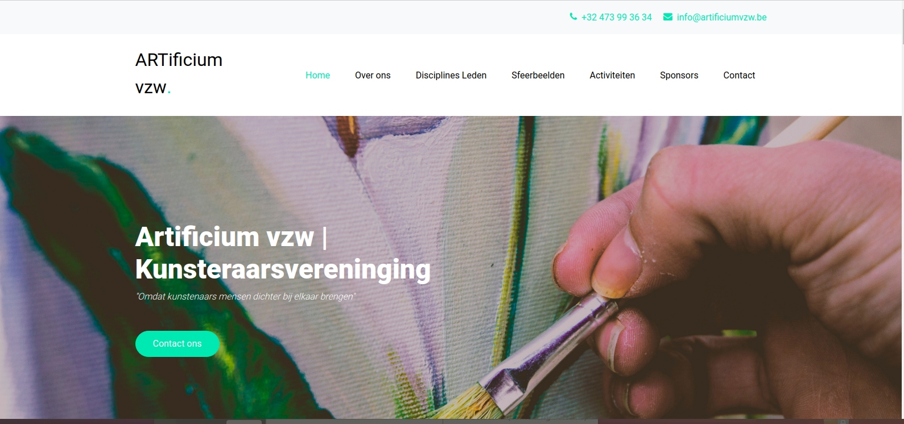

# solo-project-social-impact
Working to redesign a website on the fly

##ARTificium vzw & Presence on the Web

I created this remake because I had the honor of playing music at one of the events at this artist group did in the Rivierenhof.  At that moment I only recently began with webdesign at [BeCode](BeCode.org).  When I was directed to their [website](http://www.artificium.be/) I thought immediately that I could help bring more life into the design and enjoyment of art.  Though this is a rough draft of the current site, I feel it carries the character and better displays the most important information.  Please note that **Dutch** is not my first language but I do enjoy working in this language

##About this website

There are 6 sections to this website.

- Over ons
- Disciplines Leden
- Sfeerbeelden
- Activiteiten
- Sponsors
- Contact

Compared to the other site this is stream-lined but with much more style.  

[Check out the website here](https://josephlindzius.github.io/social-impact-clientname/index.html)

####Created by: Joseph Lindzius